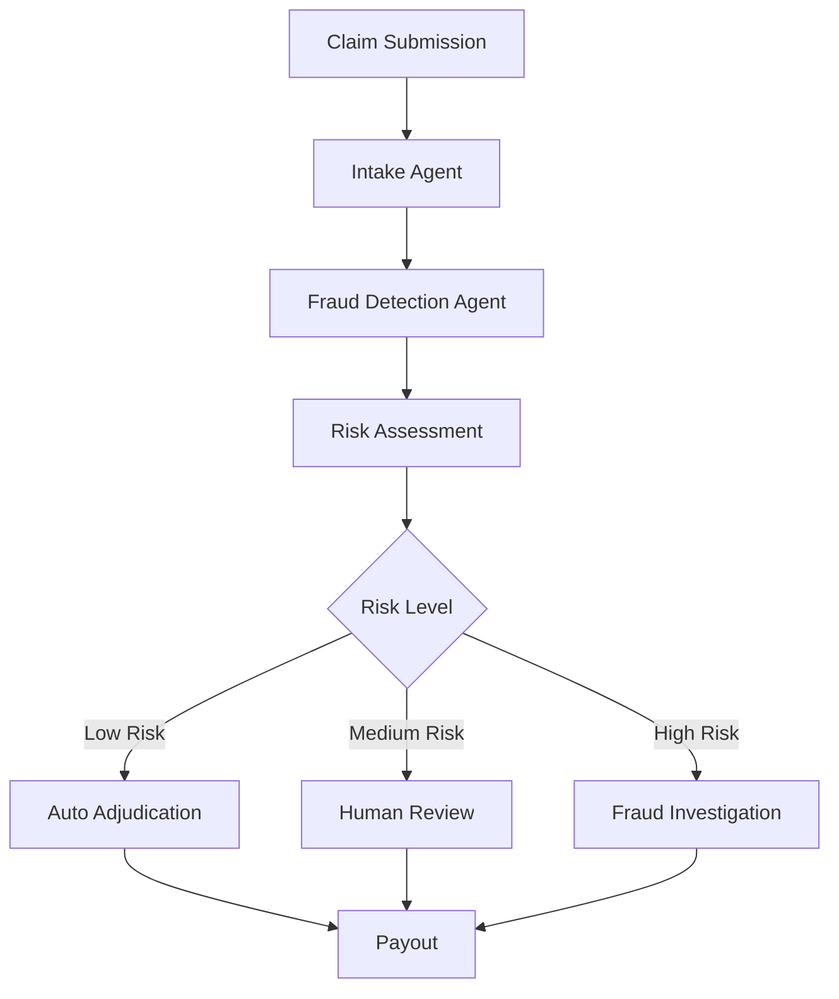

# ClaimFlow-Ai
Smarter Claims. Faster Payouts.  
AI-powered insurance claims triage and fraud detection for emerging markets.

---


## 🚀 Overview

ClaimFlow AI is an intelligent claims management platform that automates the insurance claims lifecycle from submission to payout.

Built for emerging markets, ClaimFlow AI leverages agentic AI to analyze claim evidence, detect fraud, route exceptions, and accelerate claim resolution while keeping human adjusters in control when necessary.

Instead of forcing insurance teams to manually review every claim, ClaimFlow AI automatically processes low-risk claims and escalates only suspicious or complex cases for human intervention.

The Result

• Faster claim settlements

• Reduced operational costs

• Improved fraud detection

• Better customer experience

• Scalable claims operations

---

## 🎯 Problem

Insurance claims processing remains heavily manual across many emerging markets.

Insurers often face:

• Long claim processing times

• High operational overhead

• Fraudulent claim submissions

• Poor customer experience

• Limited claims workforce

Customers can wait days or weeks for claim decisions that should take minutes.

---

## 💡 Solution

ClaimFlow AI transforms claims processing into an intelligent workflow powered by AI agents.

Every claim becomes a structured case that moves through:

```
Claim Submission
       ↓
Evidence Analysis
       ↓
Fraud Screening
       ↓
Risk Assessment
       ↓
Smart Routing
       ↓
Adjudication
       ↓
Payout
```
Low-risk claims are automatically approved and routed for payout.

High-risk claims are escalated to human adjusters with AI-generated reasoning and supporting evidence.

---

## 🏗️ How It Works

### 1. Claims Intake

Claims can be submitted through:

• WhatsApp

• Mobile Apps

• Web Forms

• Agent Portals


### Supported evidence:

• Images

• Documents

• Videos

• Voice Notes

• Text Descriptions


### 2. AI Fraud Screening

ClaimFlow AI evaluates:

• Image inconsistencies

• Missing documentation

• Suspicious claim patterns

• Duplicate submissions

• Policy mismatches


### The AI agent generates:

• Fraud risk score

• Explanation of findings

• Recommended action


### 3. Smart Case Routing

Using Maestro Case orchestration:



---

### 4. Adjudication

The system determines:

• Claim validity

• Policy eligibility

• Supporting evidence quality

• Recommended settlement amount


### 5. Payout Processing

Approved claims are routed directly for payment processing.

Customers receive updates through:

• WhatsApp

• SMS

• Email

---


## 🧠 AI Architecture

```
┌───────────────────────┐
│ Claim Submission      │
│ WhatsApp / Web Forms  │
└──────────┬────────────┘
           │
           ▼
┌───────────────────────┐
│ Intake Agent          │
│ Data Extraction       │
└──────────┬────────────┘
           │
           ▼
┌───────────────────────┐
│ Fraud Detection Agent │
│ Risk Scoring          │
└──────────┬────────────┘
           │
           ▼
┌───────────────────────┐
│ Maestro Case          │
│ Workflow Orchestration│
└──────────┬────────────┘
           │
     ┌─────┴─────┐
     ▼           ▼
Auto Resolve   Human Review
     │           │
     └─────┬─────┘
           ▼
      Claim Outcome
```

---

## ⚙️ Tech Stack

### Core Platform

• UiPath Agent Builder

• UiPath Maestro Case

### AI Layer

• Claude API

• LLM-powered reasoning

• Risk assessment workflows

### Communication

• WhatsApp Integration

• SMS Notifications

• Email Notifications

### Backend

• Node.js

• Express

• PostgreSQL

### Frontend

• React 

• Next.js

• Tailwind CSS

### Infrastructure

• Docker

• Cloud Deployment

• Secure API Gateway

---

## 📱 Example Workflow

A customer experiences flood damage and submits:

• Photos of damaged property

• Policy details

• Incident description

### ClaimFlow AI:

1. Extracts claim data

2. Verifies policy coverage
  
3. Analyzes image evidence
   
4. Calculates risk score
   
5. Determines routing path


### Outcome

Low Risk

✅ Auto-approved

High Risk

⚠️ Escalated to adjuster with AI-generated explanation

---

## 🔒 Fraud Prevention Features

• Risk scoring engine
• Duplicate claim detection
• Pattern anomaly detection
• AI-powered evidence review
• Human-in-the-loop escalation
• Audit trail generation

---

## 📊 Impact

### For Insurers

• Reduced claim processing time

• Lower operational costs

• Improved fraud detection

• Increased scalability

### For Customers

• Faster claim resolution

• Better transparency

• Real-time status updates

• Improved trust

### For Emerging Markets

• Expanded insurance accessibility

• Faster financial recovery

• More efficient claims ecosystems

---

## 🌍 Built for Emerging Markets

### ClaimFlow AI is designed specifically for regions where:

• Mobile-first experiences dominate

• WhatsApp is widely adopted

• Insurance penetration remains low

• Claims operations require greater efficiency

### Our mission is simple:

Make insurance claims processing faster, smarter, and more accessible for everyone.

---


## 🏆 Hackathon Track

### UiPath Maestro Case – Track 1

### Insurance Claims Triage & Resolution

ClaimFlow AI demonstrates how agentic AI and intelligent case management can automate claims workflows while maintaining trust, transparency, and human oversight.

---

## 👨‍💻 Team

### Ibrahim Ashiah

Building intelligent systems that solve real-world problems across Africa.

---

## 📜 License

MIT License


